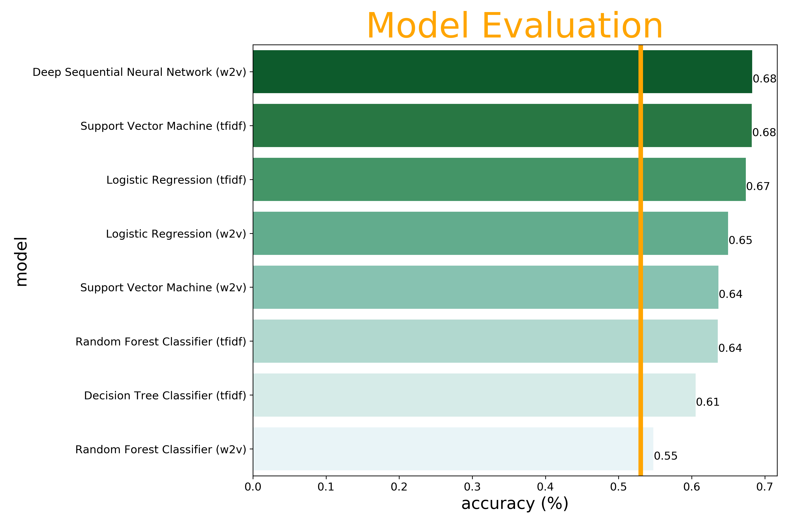
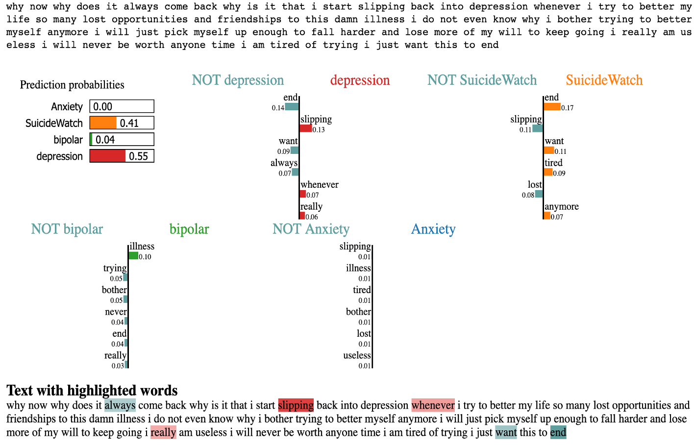

# predicting-mental-health-reddit
**General Assembly Capstone Project (6 weeks)**

The goal of this project was to predict four mental health disorders (anxiety, depression, bipolar & suicide) from Reddit posts using Natural Language Processing.

## Introduction
Mental Health is becoming more and more of a prominent issue - one in four people will be affected by a mental or neurological disorder at some point in their life. And yet, it is still a difficult subject for many to talk about. 

Because Reddit facilitates annonomous posting, most posters don't hold back about their mental health struggles, and so Reddit provides a large amount of accurate data to analyse. 

## Data Collection & Pre-Processing
Luckily, there is a large dataset on Google BigQuery (fh-bigquery/reddit_posts) going back until 2015. Over a million rows were taken over a four year period

The cleaning of these posts was acheived using the following steps:

Removing 'deleted/removed' posts  
Removing symbols, numbers, blank lines etc.  
Spell checking the corpus  
Lemmentisation  

After the text had been cleaned, around 800,000 datapoints were left, the majority class (depression) had 53% of the total datapoints whereas the minority class (bipolar) had 9%. 

Sub-Reddit | Distribution
------------ | -------------
r/depression | ~53%
r/SuicideWatch | ~20%
r/Anxiety | ~18%
r/bipolar | ~9%

## Natural Langauge Processing & Modelling
Part of Speech tagging and Sentiment Analysis (Vader) were implemented and then the models were trained using both tfidf and Word2Vec. All models beat the baseline of 53%.

## Lime implementation
The tfidf model can be explained using Lime.

